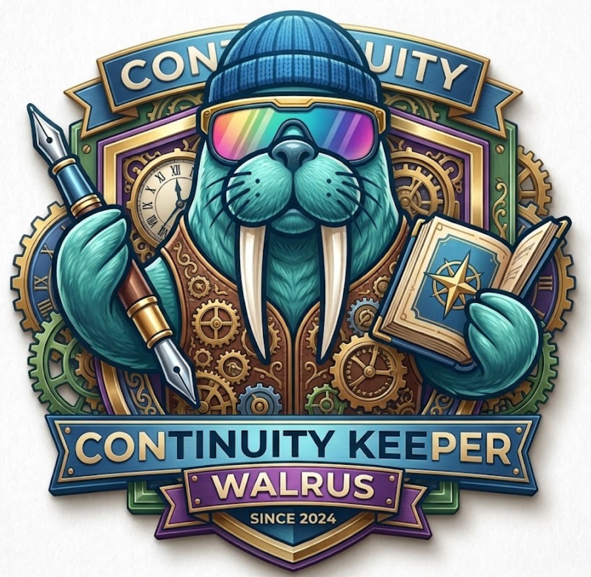
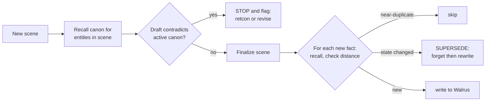

<div align="center">



# Continuity Keeper

**A self-enforcing, portable, wallet-owned _story bible_ on Walrus Memory.**

It keeps an AI co-writer consistent with your story's canon — and when the story genuinely
changes, it _truly retires_ the old fact so it never contradicts you again.

**[▶ Demo video](https://youtu.be/2AdYwwUwucY)** · **[Pitch deck](docs/deck/Continuity-Keeper-Pitch-Deck.pdf)** · **[DeepSurge](https://www.deepsurge.xyz/projects/7d2e4186-d64f-4199-8944-7b3d0b0a6c20)** · **[Submission tx](https://suivision.xyz/txblock/8WGSdpAiZUgnHYmFWNtGXF4yqMbpBtUo6M13qKbBM6MA)**

`Walrus Mainnet` · account `0x8dd9…c9d7` · **41 blobs** · **2 supersessions** · [proof ↓](#proof-on-walrus-mainnet)

</div>

---

## TL;DR

AI co-writers contradict the canon they just established — dead characters come back, magic
rules break, timelines fold. Continuity Keeper is **one system prompt + a tiny CLI** that gives
the agent a story bible on [Walrus Memory](https://docs.wal.app/walrus-memory): it **recalls
canon before writing**, **blocks contradictions**, and **supersedes** facts for real when the
story changes. It's portable across any AI tool, encrypted, and yours.

---

## The problem

### The symptom
Write a novel with an AI long enough and it starts breaking its own world. The four contradiction
types authors report, in order of frequency:

| | Example |
|---|---|
| **Character** | eye colour changes; a personality flips; **a dead character speaks again** |
| **World** | the magic system violates a rule it set two chapters ago |
| **Plot** | an object that was destroyed reappears intact |
| **Timeline** | events happen in an impossible order |

### Why it happens (the root cause)
It isn't a prompting mistake — it's architectural. LLMs reason inside a fixed **context window**,
and attention **degrades in the middle** of long inputs. The [_Lost in the Middle_](https://arxiv.org/abs/2307.03172)
study (Liu et al., TACL 2024) showed accuracy drops **>30%** when the needed fact sits mid-context,
in a U-shaped curve replicated across six model families. So once a story outgrows what the model
can reliably attend to — in practice **around chapter 10–15** — canon established early simply
stops being "seen," and the model confidently contradicts it.
([Novarrium](https://novarrium.com/blog/ai-story-consistency-complete-guide) calls this
*"the central unsolved problem of AI-assisted long-form fiction."*)

### Who has it, and how often
Anyone co-writing a novel, serial, or TTRPG campaign with AI — **every scene, every session**. It's
common enough that a whole tools market exists around it
([_Best AI for Novel Continuity Checking (2026): 5 tools compared_](https://www.inkfluenceai.com/blog/best-ai-novel-continuity-checking-2026)),
and people already pay for partial fixes: **Sudowrite Story Bible**, **NovelCrafter
[Codex](https://ilampadmanabhan.medium.com/sudowrite-vs-novelcrafter-bdc3f33ba95f)** (*"a living
archive… evolving states across the timeline"*), Novarrium's *Logic-Locking*.

### Why today's fixes fall short
- **Manual tracking** (pasting character sheets into every prompt) puts the whole burden on the
  author and gets worse as the book grows.
- **Vendor story bibles** live inside one app, are enforced by hand, and the vendor holds your
  unpublished manuscript. Open a different AI tool and your canon doesn't come with you.

---

## Why Walrus Memory

A story bible on Walrus Memory does four things a vendor database can't do *together*:

| | |
|---|---|
| 🧭 **Portable** | one wallet-owned memory, recalled from **any** MCP client (Claude Code, Cursor, Codex, Gemini CLI) — canon isn't trapped in one app |
| 🛡️ **Self-enforcing** | recall-before-write and the contradiction-guard run automatically, not by hand |
| 🔐 **Owned & private** | you hold the keys; sensitive canon can be SEAL-encrypted so plaintext never leaves your machine |
| 🕰️ **Provable history + current truth** | superseded canon is retired from recall but its blob **persists on Walrus** — an immutable record of what canon *was*, while recall returns only what it *is* |

This is the answer to *"why does this need Walrus and not a text file or Pinecone?"* — the bundle
is web3-native and vendor-DB-impossible.

---

## The solution

Continuity Keeper is a memory **policy**, not a "please remember" line. It applies principles from
the agent-memory literature — structured, self-organizing notes and **memory evolution /
supersession** ([A-MEM](https://arxiv.org/abs/2502.12110), Xu et al. 2025) over a typed memory
taxonomy ([CoALA](https://arxiv.org/abs/2309.02427), Sumers et al. 2024) — to the concrete job of
keeping fiction canon straight.



1. **Recall first** — before drafting a scene, recall each in-scope entity's canon.
2. **Contradiction-guard** *(the money shot)* — before finalizing, compare the draft to active
   canon; on a conflict, **stop and flag** instead of silently overriding.
3. **Store only durable canon** — character state, places, objects, rules, events, timeline —
   **never** the prose itself, private notes, or speculation. Each fact is a structured note:
   `[canon:<type>] <entity> — <fact/state> (as of: <ch>)`.
4. **Dedup** — recall each candidate and compare by cosine distance
   (`<0.25` skip · `0.25–0.55` related · else new).
5. **Supersede** — when canon changes, retire the entity's outdated facts and write its current ones.

### How supersession works (the hard part, done honestly)
Walrus Memory's only public delete is **namespace-level** (`POST /api/forget`). Continuity Keeper
turns that into *targeted* supersession by giving **each entity its own small namespace**, so
"forget + rewrite" touches one entity only:

```bash
continuity supersede --type char --entity "Elara" --story saltglass --facts-file current.txt
#  recall the entity's facts → forget its namespace → rewrite its current facts
#  → the old "alive" facts stop surfacing in recall; their blobs remain on Walrus as history
```

---

## Quick start

**1 · Credentials** — get a Walrus Memory account + delegate key from the playground, then save
`~/.memwal/credentials.json` (chmod 600, never commit):
```json
{ "delegatePrivateKey": "…", "accountId": "0x…", "serverUrl": "https://relayer.memory.walrus.xyz" }
```
**2 · MCP server** (Claude Code shown) — exposes `memwal_recall / remember / remember_bulk / analyze`:
```bash
claude mcp add --scope user memwal -- npx -y @mysten-incubation/memwal-mcp
```
**3 · The prompt** — paste [`prompt/continuity-keeper.md`](prompt/continuity-keeper.md) into your agent's system prompt.

**4 · The helper** — for `supersede` / `export` (what MCP can't do):
```bash
pnpm add @mysten-incubation/memwal
node tools/continuity/cli.mjs help
```

---

## Proof (on Walrus Mainnet)

Run against the **production relayer** — full evidence in [`docs/proof/mainnet-proof.md`](docs/proof/mainnet-proof.md).

- **Agent ID:** `0x8dd9d47183f88a1ab70515bed7494685487458614131e2004f7d18f1d3b9c9d7`
- **41 blobs** on mainnet across the demo runs (the reproducible run writes 19); **2 supersessions**.
- **Reproduce:** `bash demo/run-proof.sh`

The run establishes the canon of an original short story (**Saltglass**, in [`demo/`](demo/)),
confirms the protagonist is alive, kills her in Ch.7 via `supersede`, and shows recall now returns
**only her death** — while the retired "alive" blob is still resolvable on Walrus.

---

## Research & references

**Root cause of the pain**
- Liu et al., *Lost in the Middle: How Language Models Use Long Contexts* — [arXiv:2307.03172](https://arxiv.org/abs/2307.03172)

**Design grounding (agent memory)**
- Xu et al., *A-MEM: Agentic Memory for LLM Agents* — [arXiv:2502.12110](https://arxiv.org/abs/2502.12110) (structured notes; memory evolution/supersession)
- Sumers et al., *Cognitive Architectures for Language Agents (CoALA)* — [arXiv:2309.02427](https://arxiv.org/abs/2309.02427) (memory taxonomy → namespaces)

**The pain is real, common, and monetized**
- Novarrium — [*Why your AI novel falls apart after chapter 5*](https://novarrium.com/blog/ai-story-consistency-complete-guide)
- inkfluenceai — [*Best AI for Novel Continuity Checking (2026): 5 tools compared*](https://www.inkfluenceai.com/blog/best-ai-novel-continuity-checking-2026)
- Sudowrite Story Bible · NovelCrafter [Codex](https://ilampadmanabhan.medium.com/sudowrite-vs-novelcrafter-bdc3f33ba95f)

**Platform**
- [Walrus Memory (MemWal)](https://docs.wal.app/walrus-memory) · [Walrus](https://docs.wal.app) · [Seal](https://docs.wal.app) (encryption)

---

## Repository layout
```
prompt/continuity-keeper.md   the copy-pasteable system prompt (the deliverable)
tools/continuity/             the helper CLI (supersede/forget/export) + unit tests
demo/                         original "Saltglass" corpus, canon, and run-proof.sh
docs/proof/                   mainnet proof (agent id, blobs, supersession evidence)
docs/submission.md            jam submission answers
```

## License
MIT — see [LICENSE](LICENSE).
